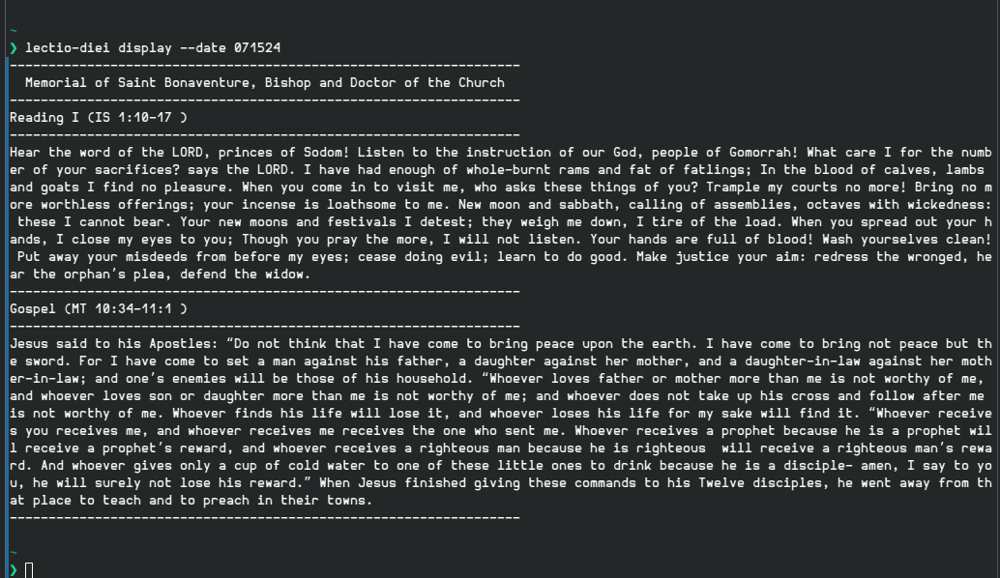

# Lectio Diei

[](https://crates.io/crates/lectio-diei)

CLI application for retrieving, storing, and displaying the daily Catholic readings. Retrieved from the [United States Conference of Catholic Bishops site](https://bible.usccb.org/). After being retrieved, the readings are stored in a local sqlite database. This way, they can be displayed on-demand with low latency.

While the core functionality is present, this is still pre-release software. Command line interface is subject to change.



## Compatibility
For now, only Linux is supported. The current issue is that the paths for the database, log, and config file follows the [XDG specification](https://specifications.freedesktop.org/basedir-spec/basedir-spec-latest.html) which MacOS and Windows do not follow. I do have plans to address this.

## Installation
`lectio-diei` can be installed from crates.io using `cargo`

### Prerequisites
 - Install the [Rust toolchain](https://www.rust-lang.org/tools/install)
 - Add ~/.cargo/bin to your PATH environment variable

### Install with Cargo
```bash
cargo install lectio-diei --locked
```
After the install command completes, the lectio-diei binary will then be installed at ~/.cargo/bin. Since this is in your PATH, you should be able to execute the application with:
```bash
lectio-diei display
```

## Usage

The most basic usage involves two commands:
- ```lectio-diei db refresh``` - Updates your database with readings, deleting old readings
- ```lectio-diei display``` - Displays the readings for today

More options can be seen by simply running ```lectio-diei```

## Configuration
After running any valid command at least once, you should have a config file at ~/.config/lectio-diei/config.toml. Edit this file to change number of entries stored, or default display options.

## Plans for 1.0
- [ ] Colors and formatting options for the Readings
- [ ] Adding the Alleluia as an option
- [ ] Show and change config options from commandline
- [ ] Windows support (maybe others?)
- [ ] Store single day without displaying
- [ ] No database mode
- [ ] Database-only mode (Don't retrieve from web if you don't already have it)
- [ ] Additional logging options
- [ ] Formalized and documented error codes

And maybe more...
## License

Licensed under the MIT license [LICENSE](LICENSE)
